# AWS Assignment 

## Objective
The objective of this assignment is to Replace Unencrypted EC2 Root Volume with an Encrypted Root Volume Using an EBS Snapshot, without losing any existing data.

## AWS Service Used

- Amazon EC2
- Amazon EBS
- Amazon EBS Snapshots
- AWS KMS (Key Management Service)

## Architecture / Workflow

The following workflow was used to replace the unencrypted root volume with an encrypted one:

1. Launch EC2 instance with an unencrypted root volume
2. Create snapshot of the unencrypted root volume
3. Copy snapshot with encryption enabled
4. Create a new encrypted EBS volume from the encrypted snapshot
5. Stop the EC2 instance
6. Detach the old unencrypted root volume
7. Attach the encrypted volume as the new root device
8. Start the EC2 instance
9. Verify that the data is preserved

This process ensures encryption is applied without any data loss.

## Repository Structure

aws-ec2-root-volume-replacement/
│
├── README.md
├── screenshots/
│   ├── 01_screenshot_ec2_ami.png
│   ├── 02_instance_initialized_ap_south_1a.png
│   ├── ...
│   └── 35_screenshot_conclusion.png

## Table of Contents

- Objective
- Step 1 – Launch EC2 Instance
- Step 2 – Connect to Linux Instance
- Step 3 – Stop the Instance
- Step 4 – Create Snapshot
- Step 5 – Copy Snapshot with Encryption
- Step 6 – Create Encrypted Volume
- Step 7 – Detach Old Root Volume
- Step 8 – Attach Encrypted Volume
- Step 9 – Start Instance
- Step 10 – Verify Data
- Conclusion
- Resource 

# ✅ STEP 1 – Launch EC2 Instance with Unencrypted Root 

🔹 Instance Details

. Instance Name: unencrypted-root-instance

. Description:
EC2 instance launched with an unencrypted root EBS volume to demonstrate replacement with an encrypted volume using snapshot method.

. AMI: Amazon Linux 2

. Instance Type: t2.micro

. Region: Asia Pacific (Mumbai) (ap-south-1)

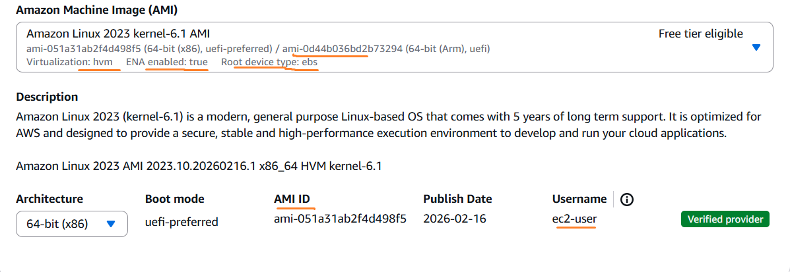

🔑 Key Pair Creation

. Key Pair Name: unencrypted-keypair

. Key Pair Type: RSA

. Private Key Format: .pem

After creating the key pair:

. Download the .pem file

. Store it securely

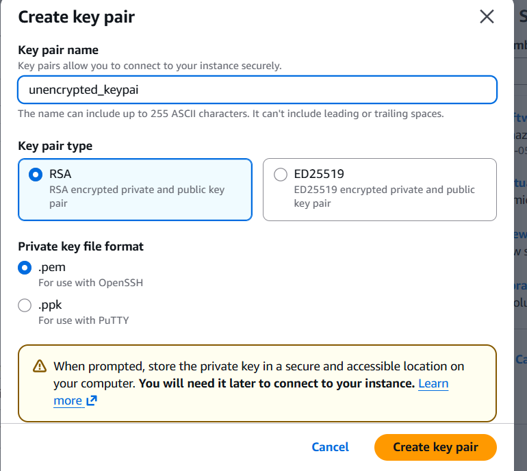

💾 Storage Configuration

. Root Volume Type: gp2 or gp3

. Encryption: ❌ Disabled (Intentionally)

. This ensures the root volume is unencrypted.

Screenshot Reference:
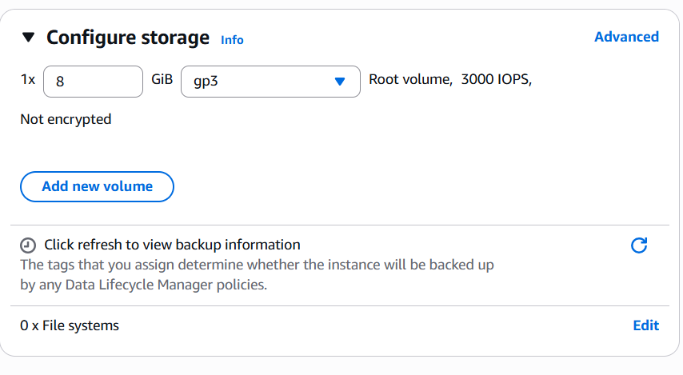

💾 instance Launched ap-south-1a

. Instance initialized
Screenshot Reference:
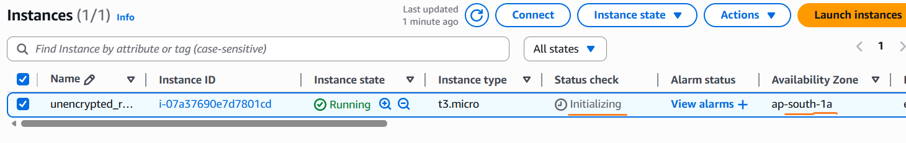

. Instance Running
Screenshot Reference:
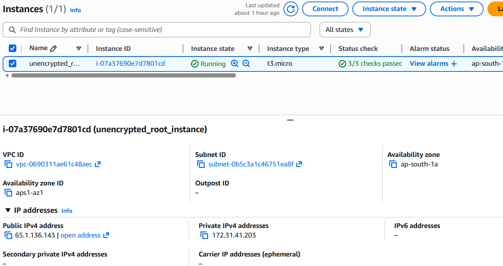

# ✅ STEP 2 – Connect to Linux Instance

Use:

. MobaXterm (recommended)
. select SSH
. provide hostname and username
. advanced SSH settings
. browse to .pem key
. accept and connected successfully to linux

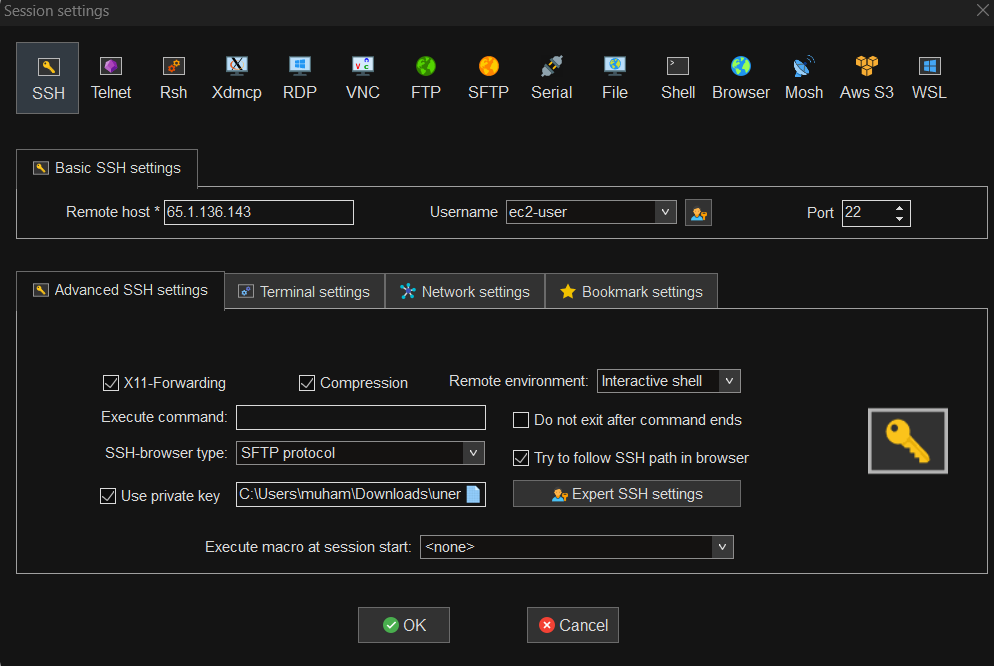

Login Commands:

. Switch to Root User : sudo su
. ls : test_data.txt   test_data_.txt.save
. cat /home/ec2-user/test_data.txt : The file exists on the EC2 instance within expected data. This file will serve as a checkpoint to confirm that no data is lost when the root volume is replaced with an encrypted volume.

Screenshot Reference:
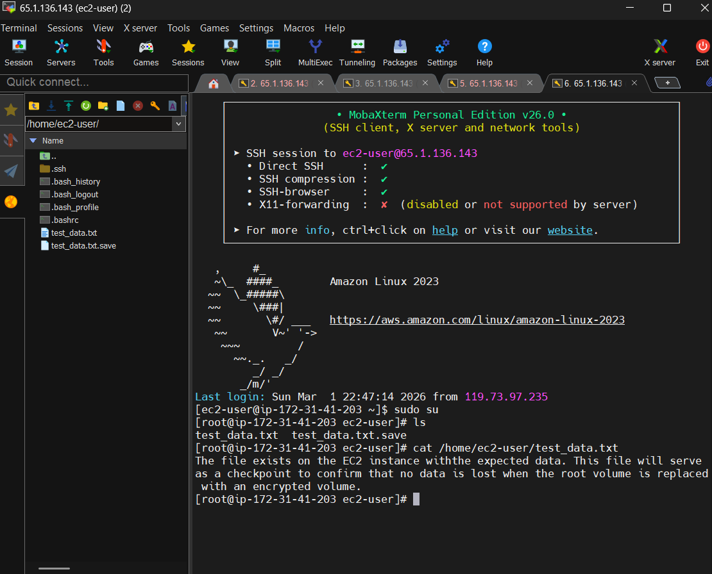

# ✅ STEP 3 – Create Snapshot of Unencrypted Root Volume

. Go to Elastic Block Store → Volumes

. Select the root volume attached to the instance

. Click Actions → Create Snapshot

Screenshot Reference:
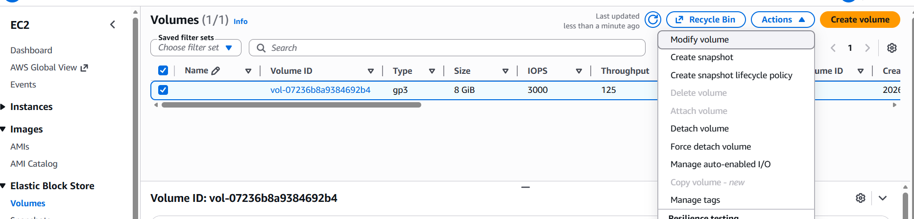

🔹 Snapshot Details:

. Name: unencrypted-root-snapshot

. Description: Snapshot of unencrypted root volume before encryption

Screenshot Reference:
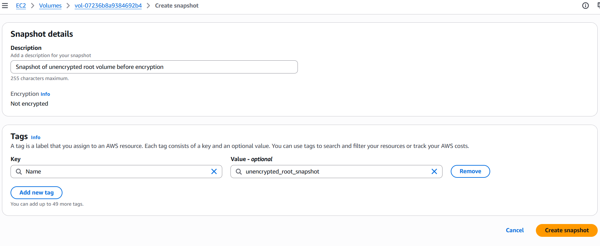

. snapshot created successfully

Screenshot Reference:
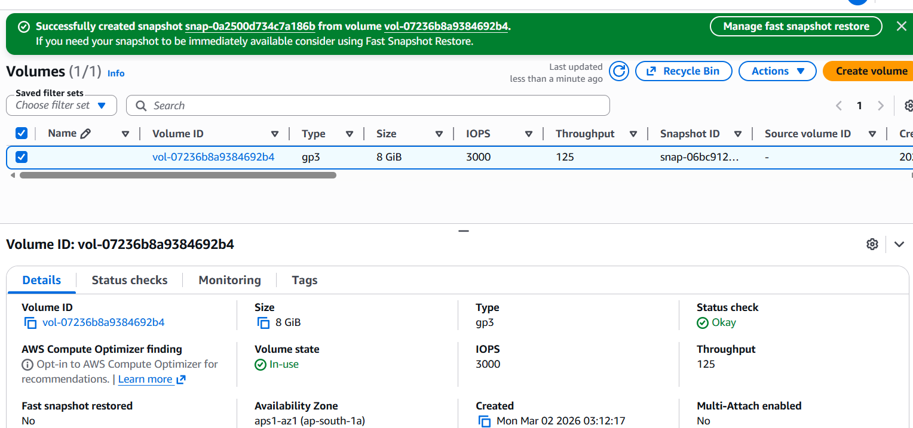

# ✅ STEP 4 – Stop the Instance

Go to AWS Console:

. Select Instance

. Click Instance State

. Click Stop

Screenshot Reference:
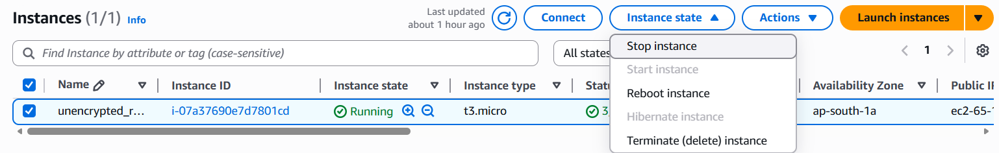

. Wait until instance state becomes Stopped

Screenshot Reference:
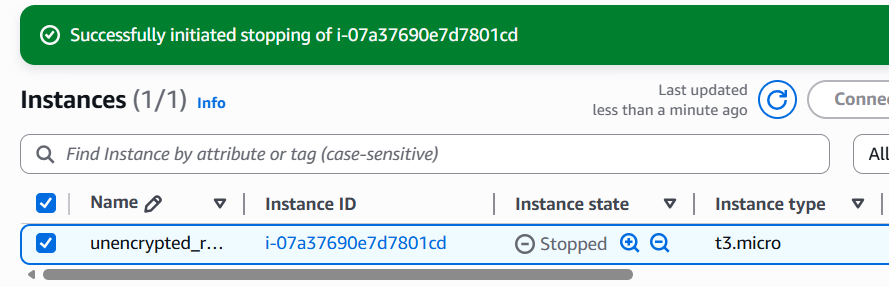

# ✅ STEP 5 – Copy Snapshot with Encryption Enabled

Now we create an encrypted copy.

. Go to Snapshots

. Select unencrypted-root-snapshot

. Click Actions → Copy Snapshot

Screenshot Reference:
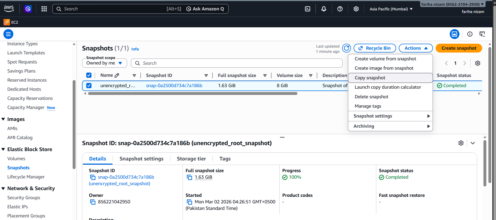

In copy options:

. description : Encrypted copy of unencrypted root snapshot for root volume replacement in same region (ap-south-1)

Screenshot Reference:
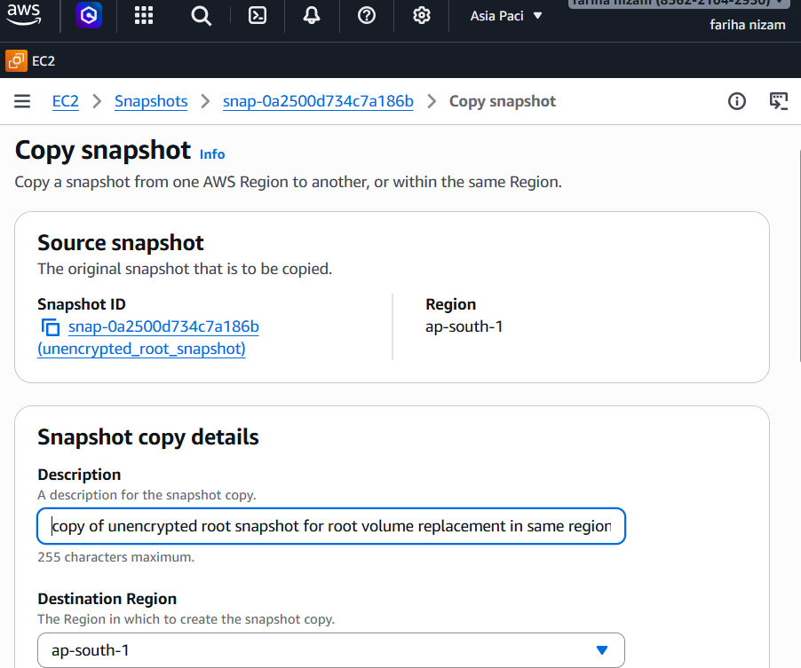

. Copy Snapshot with Encryption Enabled
Select default AWS KMS key

. AWS automatically used AWS Key Management Service (KMS) to encrypt the snapshot.

. So the service responsible for encryption is: AWS Key Management Service (KMS) 🔐

Screenshot Reference:
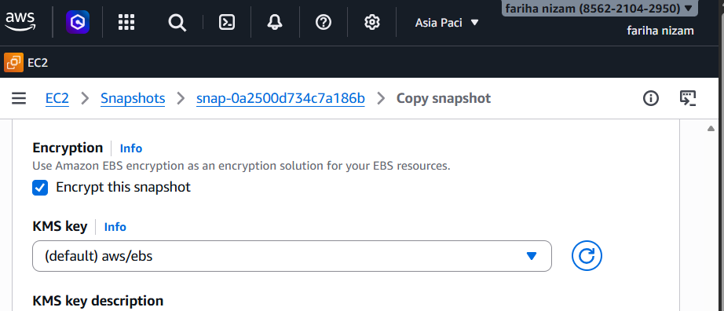

✅ Enable Encryption

. Select default AWS KMS key

🔹 Encrypted Snapshot Name:

. encrypted-root-snapshot

Screenshot Reference:
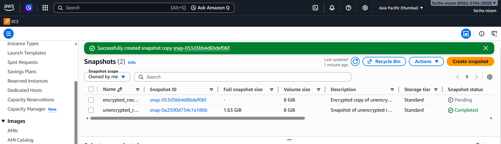

# ✅ STEP 6 – Create Encrypted Volume from Encrypted Snapshot

. Select encrypted-root-snapshot

. Click Actions → Create Volume

Screenshot Reference:
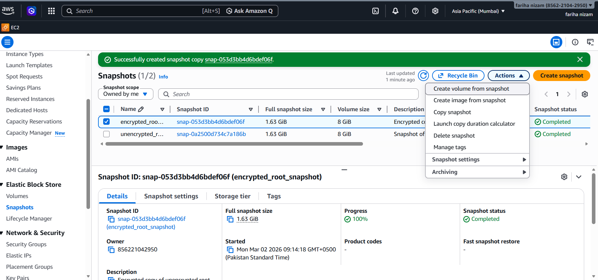

IMPORTANT:
🔹Choose same Availability Zone as original instance

🔹Encryption: ✅ Enabled (automatically)

Screenshot Reference:
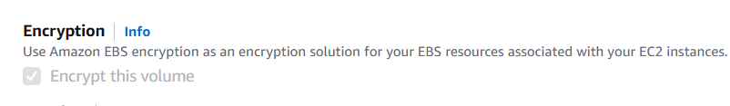

🔹 Volume Name: encrypted-root-volume

Screenshot Reference:
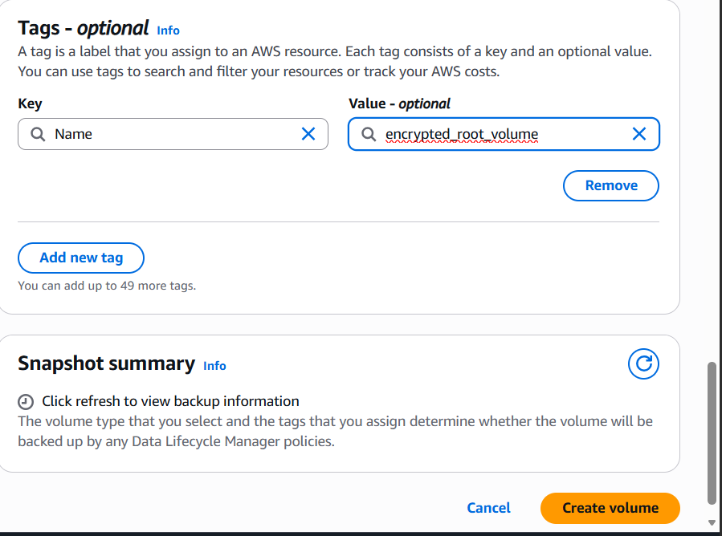

 🔹 create volume details page
Field	Value:
. Volume Type	gp3 (default)
. Size	Same as snapshot (8 GiB)
. Availability Zone	Same as EC2 instance (ap-south-1a)

Screenshot Reference:
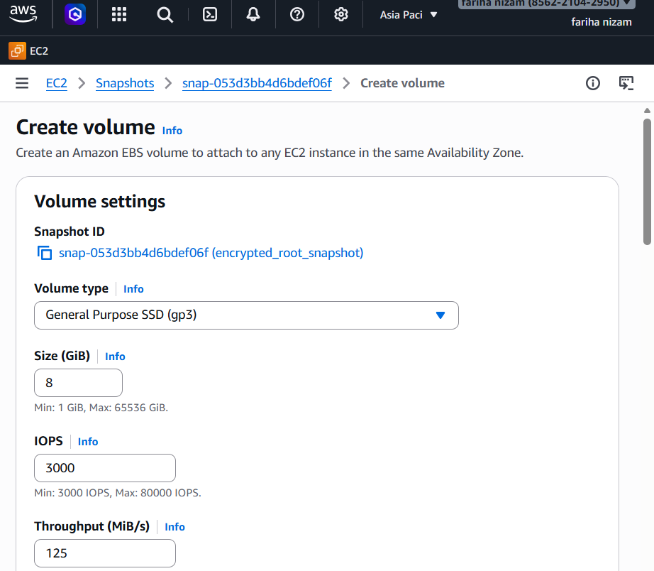

Screenshot Reference:
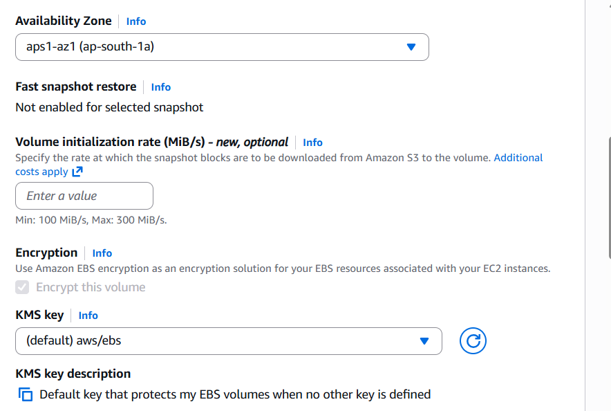

# ✅ STEP 7 – Detach Old Root Volume

🔹 Step 1 – Go to Volumes

🔹 Step 2 – Identify the Old Root Volume

. Look for the volume attached to instance:

. Check Attachment column → it should say instance ID (i-07a37690e7d7801cd)

. Check Size → matches your root volume (e.g., 8 GiB)

. Check Encryption → should be No for the unencrypted root

This is the original unencrypted root volume.

🔹 Step 3 – Detach Volume

. Tick the checkbox next to that volume

. Click Actions → Detach Volume

Screenshot Reference:
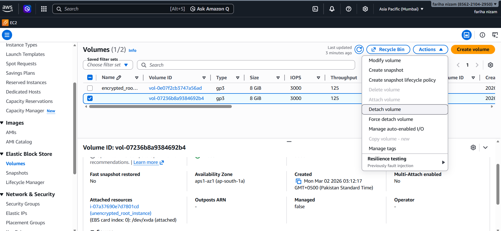

Screenshot Reference:
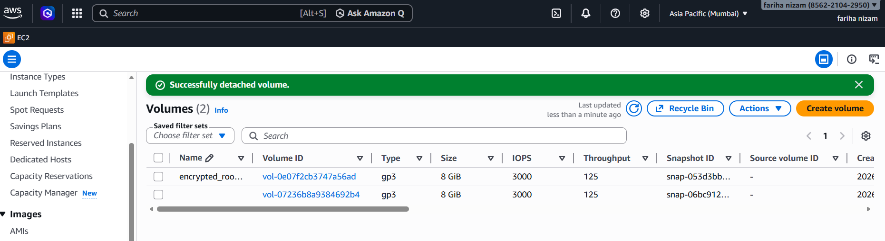

. Wait until State shows available (not attached to any instance)

💡 Important Notes:

. Make sure instance is still stopped

. Do not delete the old volume yet — just detach it.

. This ensures the root volume can be safely replaced with the encrypted one.

. After this, we can move to attach the new encrypted volume as the root volume.

# ✅ STEP 8 – Attach New Encrypted Volume as Root

🔹 Step 1 – Go to Volumes

. Find encrypted-root-volume (the one created from the encrypted snapshot)

🔹 Step 2 – Select the Volume

. Tick the checkbox next to encrypted-root-volume

🔹 Step 3 – Attach Volume

. Click Actions → Attach Volume

Screenshot Reference:
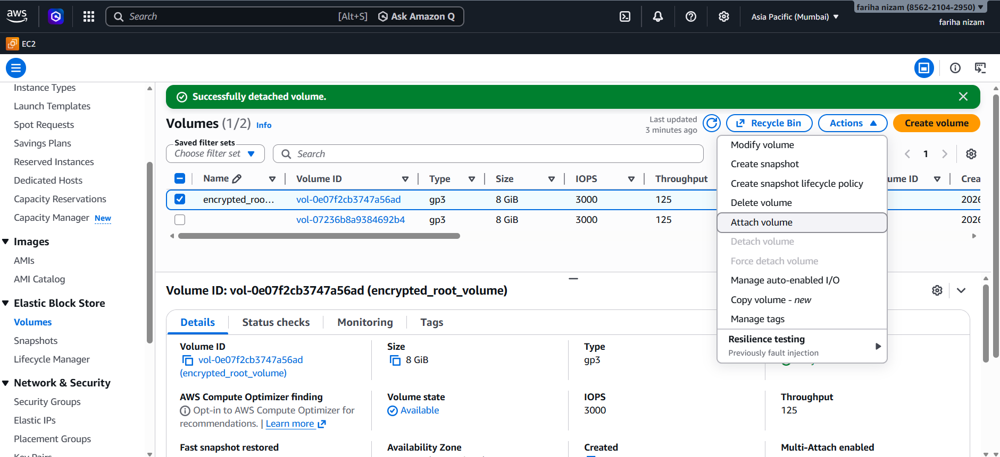

🔹 Step 4 – Configure Attachment

In the popup:

. Instance: Select unencrypted_root_instance

. Device Name: Enter /dev/xvda (must match original root device)

. Click Attach

Screenshot Reference:
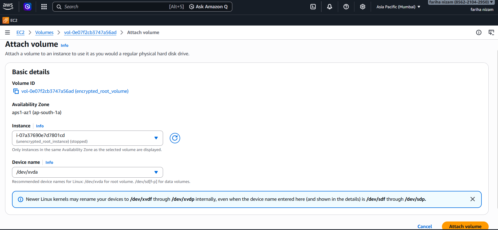

🔹 Step 5 – Confirm

. Volume state will change to in-use

Screenshot Reference:
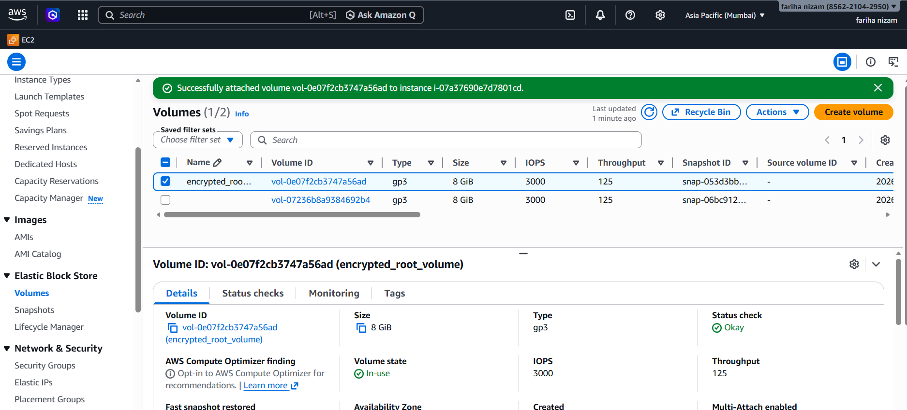

. The root volume is now encrypted EBS volume

# ✅ STEP 9 – Start the EC2 Instance

🔹Step 1 – Go to Instances

. Make sure the region = ap-south-1 (Mumbai)

. Find stopped instance: unencrypted_root_instance

🔹Step 2 – Start the Instance

. Tick the checkbox next to instance

. Click Instance state → Start 

Screenshot Reference:
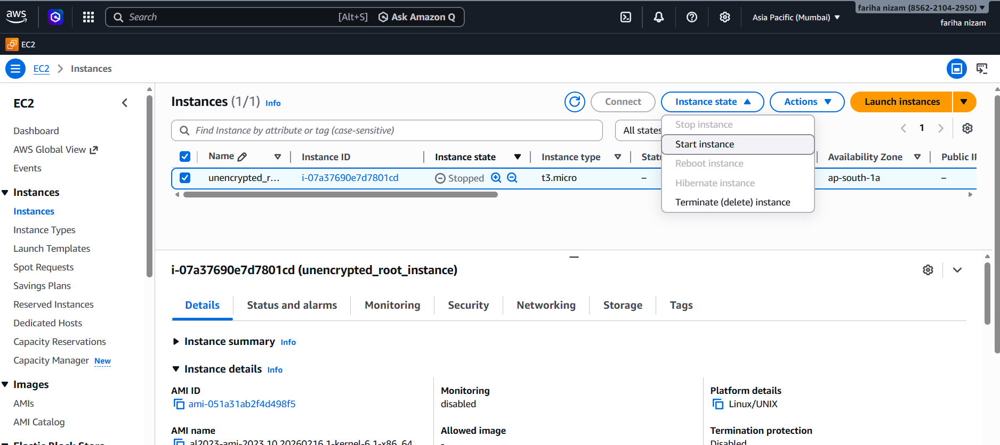

🔹Step 3 – Wait for Status Checks

. The Instance State will change from stopped → pending → running

Screenshot Reference:
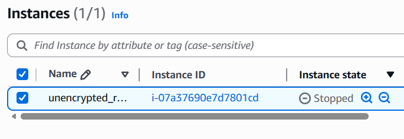

Screenshot Reference:
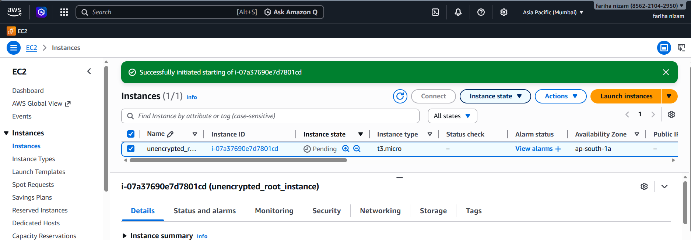

Screenshot Reference:
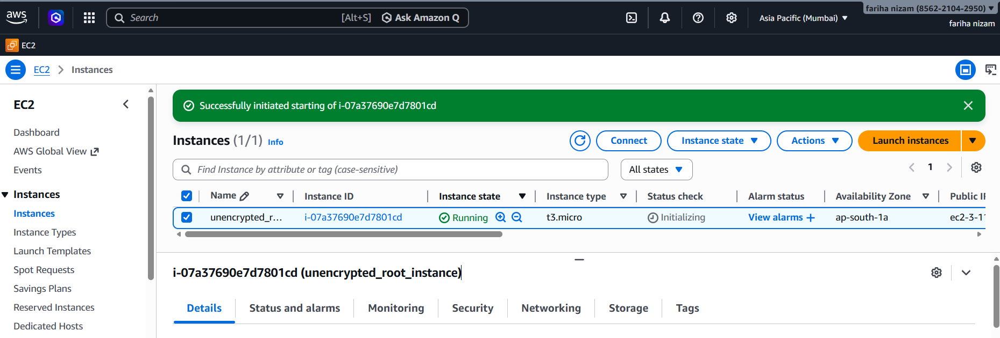

. Wait until Status Checks show: 3/3 checks passed 

Screenshot Reference:
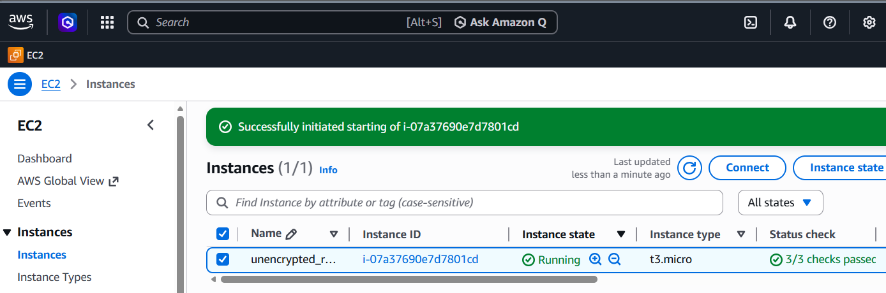

🔹Step 4 – Verify in Console

. Once running, you can connect using MobaXterm / SSH

. The instance now uses the encrypted root volume

After this, the final step is to connect via SSH and check your test file to ensure no data was lost.

# ✅ STEP 10 – Verify Data is NOT Lost

🔹 How to Verify

. Connect to instance using MobaXterm / SSH

Reconnect:

1️⃣ Switch to root (optional, if you need permissions) : sudo su

2️⃣ Navigate to home directory: cd /home/ec2-user

Screenshot Reference:
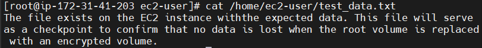

3️⃣ List files to make sure test file exists:ls -l

. You should see: test_data.txt

. This confirms the file is still on the root volume.

Screenshot Reference:
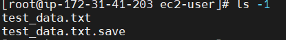

4️⃣ View the contents of test file: cat test_data.txt

. Output should show exactly what wrote before replacing the root volume.

Example: The file exists on the EC2 instance with the expected data. This file will serve as a checkpoint to confirm that no data is lost when the root volume is replaced with an encrypted volume.

Screenshot Reference:

5️⃣ Check disk usage to confirm volume is mounted: df -h

Screenshot Reference:
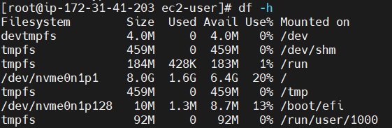

. Look for /dev/xvda mounted at /

. Confirms the instance is using the new encrypted root volume.

. this confirms root volume is mounted and in use. ✅

🔹Here’s what the df -h output tells us:

| Filesystem         | Size | Used | Avail | Mounted on  |
| ------------------ | ---- | ---- | ----- | ----------- |
| `/dev/nvme0n1p1`   | 8.0G | 1.6G | 6.4G  | `/`         |
| `/dev/nvme0n1p128` | 10M  | 1.3M | 8.7M  | `/boot/efi` |

. /dev/nvme0n1p1 → this is root volume mounted at /

. Size and usage match previous root volume

. This shows the encrypted root volume is properly attached and active

🔹Final Screenshot Findings: 

. Instance running

. Status checks passed

. File content displayed in the terminal

Screenshot Reference:
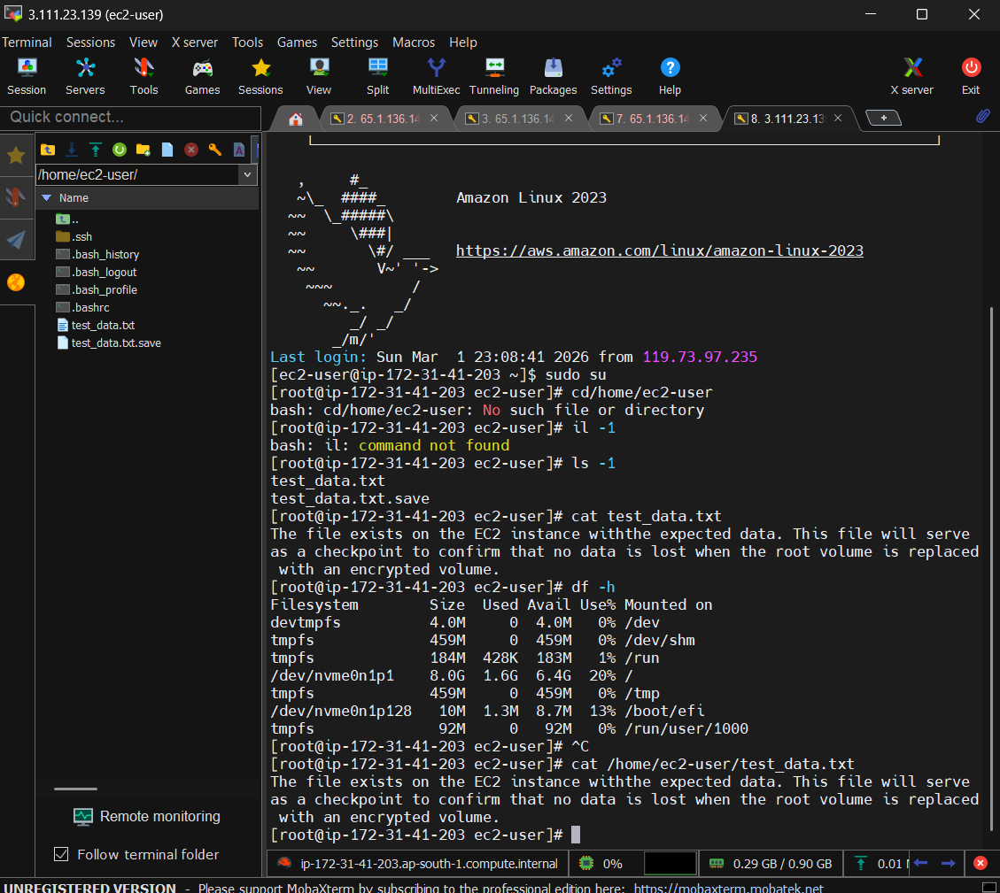

🎉 This confirms:
These steps confirm that the assignment objective was successfully achieved.: the encrypted root volume replaced the unencrypted one without losing any data. ✅

. Root volume is now encrypted

. No data was lost

. Replacement successful

## Key Learning Outcomes

Through this assignment, the following AWS concepts were demonstrated:

- Understanding EC2 root volumes
- Creating and managing EBS snapshots
- Encrypting EBS snapshots using AWS KMS
- Creating encrypted volumes from snapshots
- Replacing EC2 root volumes safely
- Verifying data integrity after infrastructure changes

# Conclusion

In this assignment, the original unencrypted root volume was successfully replaced with an encrypted root volume using an EBS snapshot.

Key Points:

- Direct encryption of an existing volume is not possible.
- A snapshot must be created first.
- A new encrypted volume must be created from that snapshot.
- The instance must be stopped before replacing the root volume.
- No data was lost during the process.

The objective of converting an unencrypted root volume into an encrypted root volume was successfully achieved.

# 🎯 Final Result

✔ Data preserved
✔ Encryption enabled
✔ Instance running 

# 🔹  Post-Lab Cleanup

After completing the assignment and verification, the AWS resources can be cleaned up to avoid unnecessary charges.

1️⃣ Terminate the EC2 Instance
🔹 Once terminated, you can no longer connect via SSH.

2️⃣ Delete EBS Volumes

3️⃣ Delete Snapshots
🔹 Once deleted, you cannot recover these snapshots, so only do this if you don’t need them